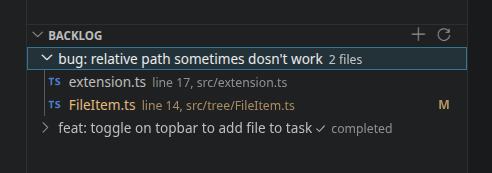

# Backlog Extension

A minimal vscodium/vscode extension for managing tasks with associated files with current line.

Tasks are by default saved to `.vscode/backlog.json`, but can be configured in your user settings, if other team members want to have their own, but not git ignored. You can set the setting for user settings to have it like: `.vscode/backlog-john.json`

### Features

- Add, edit, delete task
- Add, remove file to a task
- Add all open files to a task
- Open all files added to a task
- Toggle for completion of a task

### Instalation

1. Go to [Releases](https://github.com/lulasz/lm-backlog-extension/releases) and download the VSIX file.
2. Install it via Command Palette using `Extensions: Install from VSIX...`
3. Done

